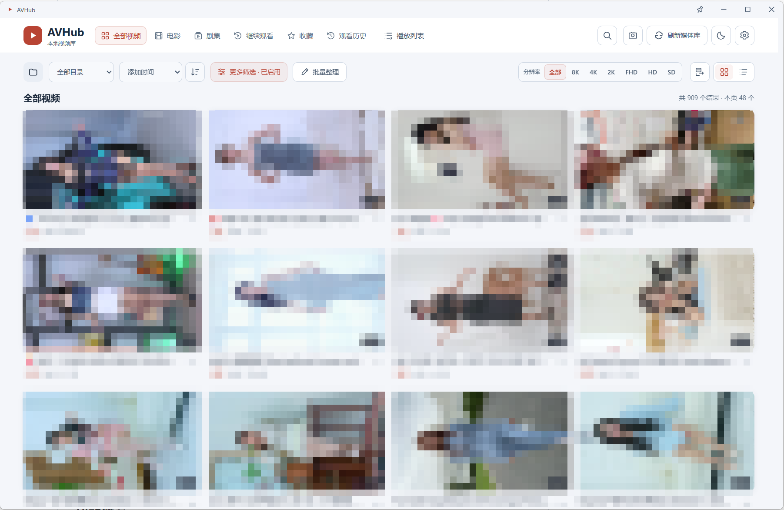

# AVHub

[English](README.en.md) · 简体中文

版本下载与更新说明请查看 [GitHub Releases](https://github.com/jhlxlml/avhub/releases)。

AVHub 是面向 Windows 的本地离线视频库与播放器：将多个视频目录汇总到一个中文界面中，按文件夹或电影、剧集浏览，并记住收藏、播放列表和观看进度。

文件整理默认关闭。在“媒体库设置 → 媒体目录”中逐目录授权后，可从视频“更多操作”执行单文件重命名或移入 Windows 系统回收站。重命名同步视频标题，保留媒体 ID、收藏、进度和片单，不提供重命名撤销。扩展名锁定，同目录外挂字幕仅保存关联，不改名或复制；视频或字幕被修改、替换后需重新匹配或导入。正在读取、播放或后台处理的文件不能整理；首版仅开放本地 NTFS，不覆盖同名文件，也不降级为永久删除。

批量整理中可将明确选中的视频移入系统回收站（每批最多 500 个）。先检查清单与文件总大小，跳过未授权、离线、正在读取或处理的项目；确认后逐项核对预览快照并执行。预览 10 分钟有效，文件变化或权限撤销时拒绝回收。可停止未开始项目，当前项会完成；结果保留成功、失败、跳过和未执行明细。不提供批量重命名，回收不会降级为永久删除，也不建立视频回收副本。

“数据管理”提供文件状态管理和文件操作记录，区分已回收、文件缺失、待核对；支持核对恢复和打开系统回收站。普通缺失项可“仅移除记录”，清理索引、收藏、进度及片单引用，不碰磁盘文件；已回收、待核对项不能这样清理。同路径视频再次扫描会作为新记录收录。删除还原由系统负责，恢复原文件后可核对恢复或刷新媒体库；文件身份不一致时需人工核对。应用不创建视频回收副本，不提供剪辑、批量重命名或移动复制。导入媒体库备份后需重新授权整理权限；数据库备份不是原视频备份。



*主界面预览，媒体封面及文件信息已做隐私遮挡。*

视频默认保留在原目录并只读；只有明确开启目录整理权限后才能重命名或移入系统回收站，不提供移动、永久删除或视频剪辑。索引、封面、设置及观看记录独立保存。完成依赖安装或准备好便携包后，日常扫描和播放不需要联网，也不抓取在线海报或影视资料。

主项目仅支持 **Electron 桌面版**：独立窗口、窗口置顶、按视频比例自适应的无边框纯净播放，以及原生文件夹操作。React 界面、FastAPI 和 localhost 媒体服务是桌面内部架构，不是独立网页版产品。

网页版历史源码位于 [archive/web-legacy-2026-10-05](archive/web-legacy-2026-10-05/ARCHIVE.md)，仅作冻结参考，不再维护，也不参与桌面打包。

当前应用界面为中文；英文 README 不代表已提供英文界面。仓库主要保存源码，不包含 FFmpeg 可执行文件、生成后的网页资源、个人媒体库或便携 EXE。

## 功能概览

### 媒体库

- 添加多个本地目录，使用原生文件夹选择器或输入路径；桌面版的添加、重新定位与截图目录选择使用 Electron 对话框，媒体/截图路径分别记忆。支持单目录扫描、全库增量刷新及中断扫描恢复。
- 网格、列表、文件夹浏览；全部视频、电影、剧集、继续观看、收藏、历史记录和播放列表。
- 播放列表采用封面信息区与横向视频条目布局，支持片单内搜索、重排、重命名、顺序起播和随机起播；大列表分页加载，适配深浅色与窄窗口。
- 在媒体库批量选择后可加入片单，已有条目不重复添加。片单支持跨页多选移除，并可撤销最近一次移除；如果片单内容或顺序随后被修改，撤销会停止以保护新顺序。
- 按名称、文件名和标签搜索，结合目录、格式、时长、观看状态筛选和排序。
- 当前筛选条件显示为可逐项移除的摘要，可统一清除并保留当前分类；窄窗口的分辨率筛选使用下拉菜单。
- 视频列表可按分辨率（总像素）或文件大小升降序排序；未知值排末尾。卡片附带文件大小，未知大小不显示假值，不额外探测原视频。
- 根据文件名与目录结构识别剧集、季、集；可手动修正标题、类型、季集号、标签和评分。
- 视频卡片的“更多操作 → 编辑信息与封面”可直接整理媒体，无需启动播放；离线文件仍可编辑信息和导入封面。
- 自动生成视频截图封面；支持导入自定义封面、从视频指定位置生成封面，以及批量编辑媒体信息。
- 服务端分页、按需加载目录与剧集数据；缩略图使用独立后台队列，可暂停、恢复，并在播放时让路。
- 设置 → 媒体目录管理后台封面与悬停预览；播放偏好中的“高级播放设置”提供默认关闭的 MKV 无损准备。封面任务统一显示排队、暂停、等待播放空闲及失败待检查状态。
- 失效目录可重新定位，保留关联的用户元数据；移除媒体目录不会删除该目录中的视频。

### 播放器

- 默认原文件直放或无损封装，不自动降画质；有损兼容播放必须主动确认。
- 续播、进度跳转、音量、倍速、音轨切换、文字字幕与字幕延迟、视频技术信息。
- 设置 → 播放偏好 → 起播方式，可选每次询问（默认）、自动接上次进度或始终从头。已看完的视频从头播放；自动连播不弹询问，除始终从头外会接续未看完视频。修改设置不清除现有记录。
- 同剧集、同目录及播放列表待播队列，支持顺序播放、随机播放和单条循环。设置 → 播放偏好 → 视频连播，可开启或关闭结束自动播放。
- 视频全屏、画中画、纯净播放；桌面窗口置顶可独立开关。
- 视频旋转、以鼠标位置为中心滚轮缩放、放大后拖动画面、一键还原。
- 一键 PNG 截图，可设置默认保存目录；不弹保存选择窗口，不中断当前播放状态。
- 键盘操作不会主动唤出已隐藏的控制栏；输入文字、菜单和设置中的快捷键有独立保护。
- 鼠标离开播放控制区立即隐藏控件，移回底部控制区显示；停在控制区上时不会自动隐藏。鼠标移动时光标保持可见，在画面区域停止移动约 400 毫秒后隐藏光标。拖动滑块、操作菜单和 Tab 键导航期间保留操作区域，暂停时同样适用。

### 数据与诊断

- SQLite 持久化媒体索引、收藏、标签、播放列表、进度和应用偏好。
- 数据库备份、包含自定义封面的完整媒体库备份与恢复；完整备份可选包含缩略图。
- 备份与诊断通过原生保存窗口选择位置，完成后显示实际路径并可在文件夹中定位；取消或失败不会覆盖已有导出文件。
- 缓存占用预览和清理、扫描与封面任务状态、播放链路诊断及桌面运行日志。
- 本机回环服务与请求校验；桌面版增加会话校验和受限的原生调用。
- 设置 → 数据管理可查看实际数据目录、打开或复制路径。点击桌面标题栏左侧 AVHub 可查看版本、构建与接口协议，复制信息或打开项目主页；也可从设置 → 帮助 → 关于进入。

## 使用已有便携包

Releases 提供两种便携格式：推荐下载文件夹 ZIP，完整解压到可写目录后运行其中的 `AVHub.exe`，避免每次启动外层自解压；请保留旁边的运行依赖，不要直接在压缩包内启动。也可使用单文件 EXE，启动时会先解压。

如果已经取得本项目构建的便携 EXE，将它放在可写目录中，双击即可启动桌面版，不需要另装 Python、Node.js 或 FFmpeg。首次启动可能需要等待解压和本地服务就绪。

媒体库默认保存在 EXE 同级的 `AVHub-data/`，不要将它当作临时缓存删除。之后按下面“第一次使用”添加视频目录即可。源码仓库本身不包含这个 EXE。

## 从源码运行

以下命令在项目根目录的 PowerShell 中执行。首次安装依赖需要联网；安装完成后的日常使用可以离线。

### 1. 准备环境

| 依赖 | 要求 |
| --- | --- |
| 系统 | Windows；桌面便携打包目标为 x64 |
| Python | 3.10 或更高；本地当前验证环境为 3.13 |
| Node.js | 22.12 或更高，满足当前锁定的前端与 Electron 依赖要求 |
| FFmpeg / FFprobe | Windows 可执行文件；放在项目 `bin/` 中，或加入 PATH |
| 浏览器引擎 | 桌面内置 Chromium；Edge 仅用于共享界面测试 |
| PowerShell 7 | 运行现有 Windows 打包脚本时需要；普通启动不要求安装 `pwsh` |

如尚未取得源码：

```powershell
git clone https://github.com/jhlxlml/avhub.git
cd avhub
```

FFmpeg 优先使用 `bin/ffmpeg.exe` 和 `bin/ffprobe.exe`，找不到时才使用 PATH。用于兼容转码的构建应支持 H.264 / AAC；HDR 色调映射还需要相应的 `zscale` / `tonemap` 滤镜。

**手动打包时，两份可执行文件必须位于 `bin/`，仅配置 PATH 不够。** 所用构建的许可证和构建说明也应与 `bin/FFmpeg-LICENSE.txt`、`bin/FFmpeg-BUILD-INFO.txt` 保持一致。

### 2. 安装依赖

建议使用虚拟环境：

```powershell
python -m venv .venv
.\.venv\Scripts\Activate.ps1
python -m pip install -r requirements.txt
npm ci
node node_modules/electron/install.js
```

如果虚拟环境激活被 PowerShell 执行策略阻止，可以在当前终端先执行 `Set-ExecutionPolicy -Scope Process -ExecutionPolicy Bypass`，再激活。该设置仅作用于当前进程。

使用 `npm ci` 按 `package-lock.json` 安装，避免无意升级依赖。Electron 运行时需显式安装；上述安装命令需要联网。后续的 `python`、测试和打包命令应使用同一个已安装依赖的 Python 环境。

### 3. 启动桌面版

```powershell
npm run electron:dev
```

该命令构建网页和 Electron 主进程，然后启动桌面窗口；本地后端由 Electron 管理，自动选择可用端口，不需要另外运行 `run.py`。

若 Electron 无法找到正确的 Python，可在当前终端指定：

```powershell
$env:AVHUB_PYTHON = (Resolve-Path .\.venv\Scripts\python.exe).Path
npm run electron:dev
```

### 4. 统一桌面启动入口

```powershell
npm run dev
```

安装依赖后也可双击 [启动AVHub.bat](启动AVHub.bat)，两者均构建并打开 Electron。`npm run electron:dev` 保留为等价入口。`run.py` 是内部服务与迁移入口，不会启动浏览器，不需要手动打开 localhost 页面。

## 第一次使用

1. 打开右上角设置 → **媒体目录**，点击“浏览本地文件夹”，或输入目录路径后添加。可添加多个目录。
2. 点击顶栏“刷新媒体库”，或在设置中“扫描此目录”。添加目录本身不会自动完成扫描。
3. 索引结果逐步出现；封面在后台继续生成。大量视频首次扫描较慢，封面未全部生成不代表扫描失败。
4. 使用顶部分类、目录筛选或文件夹浏览查找视频；在剧集视图中按剧集、季、集浏览。识别错误可手动编辑。
5. 点击视频播放，使用收藏和播放列表组织内容；观看进度自动保存，之后可从“继续观看”进入。
6. 如果视频目录迁移、盘符变化或磁盘暂时离线，在媒体目录设置中检查状态，必要时“重新定位”，再刷新索引。

应用数据目录可在设置 → **数据管理** 中查看，也可在运行诊断中确认。关闭桌面应用时若提示数据尚未保存，应按提示重试或取消退出；强制终止进程、断电不保证尚未提交的数据保留。

## 外观与封面大小

- 顶栏的太阳 / 月亮图标一键切换浅色与深色模式，播放页顶部也可切换。默认保持原有深色；视频画面上的透明控制栏与弹层仍使用深色高对比显示，不改变视频颜色。
- 点击封面墙 / 列表切换按钮左侧的“调整封面大小”图标，使用滑块或按钮选择 **紧凑、标准、舒适、宽大** 四档。默认标准与原有布局一致；每行数量根据窗口宽度自动调整。
- 大小设置同时作用于普通视频封面墙和剧集分组封面，不改变列表行、剧集单集行或播放队列。在列表模式下调节入口禁用，切回封面墙后恢复已选尺寸。
- 主题与尺寸保存到当前媒体库的 SQLite，重启后保留；同一媒体库的 Electron 端口变化不会丢失设置，媒体库备份也包含这些偏好。

调节只影响界面：不会改变查询结果、筛选、排序、每页数量或播放画质，也不会重新生成封面。紧凑模式可能让更多懒加载图片进入可见范围；宽大模式使页面更长，低分辨率封面可能显得不够锐利。仍保留每页数量限制和单视频悬停预览，不通过一次加载整个媒体库实现缩放。

## 播放方式与画质

设置 → **播放偏好** → **视频连播** 可随时开启或关闭结束后的自动播放，并选择顺序、随机或单条循环。默认按同一剧集的季、集顺序连播；未归类视频使用当前实际目录，不包含子目录，也可主动改为同目录范围。从播放列表打开时，以该列表及其排列为准。随机播放从完整范围选择，跳过当前视频和已标记离线的视频；顺序播放在最后一条结束时停止。

播放结束后有 8 秒可取消倒计时，自动切换前先保存当前进度；保存失败会留在当前视频。自动连播到未看完的视频时直接续播，已看完的视频从头播放；手动打开仍显示续播提示。设置自动保存在本地数据库，并与播放器的待播队列设置同步。

“能扫描到的格式”不等于“浏览器可以直接解码的格式”。当前索引支持 MP4、MKV、AVI、MOV、M4V、WebM、WMV、FLV、TS、MTS、M2TS；实际播放还取决于视频编码、音频编码、浏览器和设备能力。

播放策略按兼容性选择：

1. **原片直放**：使用原文件与字节范围请求，不重新编码；优先保留源画质。
2. **无损封装**：视频和兼容的音轨使用 stream-copy，保留原编码内容；不兼容音轨不会静默转换。
3. **手动兼容转码**：仅在明确确认后输出有损 H.264 HLS 流。可以选择原分辨率或较低分辨率，但都不是原画。也可只允许不兼容音轨转换，视频仍不重新编码。

默认“原画（不自动转码）”不降低分辨率、位深或将 HDR 映射到 SDR；浏览器无法通过原片/无损封装解码时会停止并解释原因，不自动切换有损模式。返回原画档会撤销本次视频和音频转换许可。底层播放 API 同样默认禁止视频和音频转码，只有显式的 `allow_video_transcode` / `allow_audio_transcode` 才能授权对应转换。

保留 4K 分辨率不等于无损。兼容转码使用有损编码；HDR / 高位深兼容转换可能映射到 SDR / 8-bit，不保留全部源动态范围或位深。不支持的 Dolby Vision 转换会明确拒绝，而不是声称原画播放。

HEVC 直放依赖浏览器、系统与硬件。MKV / TS 随机跳播在需要封装或转码时仍可能等待；应用没有集成 MPV 等原生播放引擎，不能保证所有文件都有原生播放器的解码和跳播表现。

兼容的 H.264 / AAC TS 现可使用“TS 索引直读”：首次播放建立关键帧索引并缓存在 `data/ts-index/`，后续随机跳播按需读取原文件范围、复用同一个解码器，不在磁盘复制或重编码整部视频。首次建索引会增加准备时间；异常时间轴、非标准封装或音轨切换保留兼容回退。详见 [TS 跳播与黑屏修复记录](docs/TS-INDEXED-PLAYBACK-2026-10-04.md)。

H.264 的 MKV、AVI、MOV、MP4/M4V、FLV 在确实需要封装时，可使用“索引按需封装”：只准备目标关键帧区间，跳播不重建视频源，视频编码和分辨率不变；不兼容音轨仅在单独授权后转换。索引缓存于 `data/remux-index/`，单会话分片缓存目标不超过 256MB（单个超大 GOP 及正在读取的分片可能暂时超出）。原文件直放仍是首选，取消旧读取可及时释放文件句柄；索引不适用时回退普通无损封装，不升级到视频转码。详见 [多格式跳播核查记录](docs/MULTIFORMAT-SEEK-2026-10-04.md)。

### MKV 无损播放准备

此功能**默认关闭**。可在“媒体库设置 → 播放偏好 → MKV 无损播放准备”中开启；开启后才显示视频“更多操作 → 无损播放准备”入口，并允许使用已有副本。仅建议用于原片寻址明显慢的视频，不保证所有 MKV 都加速。

手动准备会保留 MKV、所有视频/音频/字幕轨道、编码、分辨率、位深和色彩，重建并前置封装索引；不修改原文件。完成后默认音轨直放会使用副本；播放页也可以立即使用原画模式播放。若副本直放失败，会先尝试原文件。

关闭设置会停止未完成任务、新播放不再使用副本、隐藏准备入口；原文件直放和现有按需无损封装不变。已完成副本保留，不自动删除；重新开启后可以复用或在视频菜单中清理。开关保存在媒体库数据库，重启后保持。

副本缓存位于应用数据目录 `native-cache/`，额外空间可能接近原文件大小，默认总上限 8 GB；超限或空间不足会拒绝，不会降低质量缩小文件。只回收未使用、所有权可确认的应用副本；可在同一面板单独清理。源文件变更会使副本失效；已打开、暂停中的副本也受保护。准备支持进度和取消，恢复播放会中断复制、等待空闲后重新开始，退出应用停止任务。不会自动复制整个媒体库。

这一功能改善的是容器索引与寻址，不保证所有 MKV 都加速，也不能让浏览器解码它原本不支持的编码。详细验收见 [原画保护与 MKV 无损准备](docs/NATIVE-QUALITY-2026-10-05.md)。

支持内嵌文字字幕及外挂 SRT / VTT / ASS / SSA。ASS / SSA 会转换为 WebVTT，不保证复杂样式与特效；PGS / VobSub 等图片字幕暂不支持。

## 键盘与鼠标

设置 → **帮助** 中提供使用指南、快捷操作和关于应用；版本信息与手动检查更新位于“关于”。打开帮助不会自动检查更新。

播放页中的快捷键：

| 操作 | 按键 |
| --- | --- |
| 播放 / 暂停 | 空格、K |
| 后退 / 前进 10 秒 | J / L |
| 后退 / 前进 5 秒 | ← / → |
| 音量调整 | ↑ / ↓ |
| 静音 | M |
| 视频全屏 | F |
| 纯净播放 | W |
| 退出纯净播放 | Esc；视频全屏时先退出视频全屏 |
| 画中画 | P |
| 保存截图 | **C** |
| 下一条视频 | N |
| 旋转画面 | R |

鼠标滚轮以指针位置为中心缩放；放大后可拖动画面，使用还原图标恢复默认画面。Shift + 滚轮调整音量。

搜索、目录路径、标题与标签等可编辑文本框支持系统原生右键菜单：撤销、重做、剪切、复制、粘贴和全选，按当前编辑状态启用。保留 Ctrl+V 等快捷键，粘贴后使用原有搜索/编辑逻辑，不后台读取剪贴板。

播放时鼠标前进侧键快进、后退侧键快退，默认 5 秒；在“设置 → 播放偏好 → 鼠标侧键跳播”中可保存 1–120 秒的步长，重启后保留。不会触发页面前进/后退，不改变键盘或控制栏步长；菜单、设置和文字输入时不触发。鼠标驱动需使用标准前进/后退映射。

点击播放控件后，空格仍控制播放 / 暂停，不会再次触发刚点击的按钮。编辑输入框、打开菜单或设置时不抢占相应操作。

**纯净播放**隐藏媒体库与页面信息，按视频比例适配桌面窗口，控制区域覆盖在画面上；进入时自动置顶，退出时自动取消置顶并恢复原窗口。播放期间仍可手动切换置顶。片源本身包含的黑边不会自动裁切。

## 截图

在设置 → **播放偏好** → **视频截图** 中选择默认目录并点击“保存截图设置”。留空时使用应用数据目录下的 `screenshots/`；自定义目录必须已经存在且可写。

点击相机图标或按 **C** 保存 PNG，文件名包含视频标题、播放位置和截图时间，连续截图不会覆盖。不弹保存窗口，不改变播放/暂停状态，可通过桌面接口定位截图与打开目录。

截图保存的是**当前解码画面**，使用解码后的画面尺寸，不包含控件、文字字幕或显示层的缩放与旋转；片源烧录的字幕仍在画面中。转码播放时捕获的是转码输出，不保证 HDR / 10-bit 原始信息。当前不提供暂停逐帧选图功能；截图快捷键仅保留 **C**。

## 数据、备份与迁移

默认使用应用旁的 `AVHub-data/`。不要同时启动多个实例使用同一媒体库：

| 运行方式 | 默认位置 |
| --- | --- |
| 源码 Electron 版 | 项目根目录的 `AVHub-data/` |
| Electron 便携 EXE | EXE 同级的 `AVHub-data/`；不可写时回退到 Electron 用户配置目录 |
| 自定义位置 | Electron 设置 → 数据管理 → 自定义数据目录；环境变量 `AVHUB_DATA_DIR` 仍具有最高优先级 |

数据目录包含 `library.db`、缩略图、自定义封面、播放缓存等；桌面版还保存 Chromium 配置与运行日志。截图默认也保存在此目录，但可另设位置。

桌面版请选择**空目录**。确认后当前会话继续使用原目录，正常退出并重新打开时才复制数据库、设置、观看记录、播放列表和封面；旧目录保留，原视频、截图、播放缓存和 Chromium 配置不迁移。迁移读取 SQLite 一致性快照，拒绝覆盖已有媒体库；失败时停止启动，旧数据不删除。建议先完整备份并确保目标有足够空间（当前迁移上限 2 GB）。

目录配置保存在应用旁的 `avhub-data-location.json`，不提交到 Git。首次升级时若检测到旧默认媒体库，会复制到空的 `AVHub-data/`；多个旧媒体库不会自动合并。便携移动时，自定义绝对路径不会自动变化。

例如，使用独立数据目录运行桌面开发版：

```powershell
$env:AVHUB_DATA_DIR = 'D:\AVHubData'
npm run dev
```

- **数据库备份**只包含 SQLite 数据，不包含封面图片、视频和截图。
- **完整媒体库备份**包含数据库和自定义封面，可选包含缩略图；不包含源视频、截图或 HLS 临时缓存。
- 恢复前先备份当前媒体库。不要让多个后端实例同时使用同一个数据目录。
- 移动便携版时，完全退出应用后将 EXE 与 `AVHub-data/` 一起移动；外部视频路径仍需可访问，失效路径要重新定位。
- 自定义截图目录不会随着便携目录自动移动，截图需另外备份。
- 设置中的缓存清理只处理应用管理的可清理数据，不删除原视频或用户截图。

## 开发与测试

### 桌面开发

```powershell
npm run dev
```

修改界面或后端后，正常退出并重新执行此命令。Vite 仅构建内部界面。浏览器界面/解码测试使用专用隔离服务的测试标记，不是浏览器产品；正式验收以真实 Electron / 便携 EXE 为准。

### 常用验证命令

在已安装依赖的 Python 环境中运行；界面测试配置使用本机 Microsoft Edge，媒体测试需要 FFmpeg。

```powershell
npm run build
npm run build:electron
npm run test:backend
npm run test:ui
npm run test:electron
npm run test:electron:screenshots
npm run test:electron:window
npm run test:electron:library-controls
npm run test:electron:shutdown
```

更多桌面专项验证、跳播和大媒体库基准入口见 [package.json](package.json) 与 [scripts/](scripts/)。基准报告应区分合成索引、真实磁盘扫描和真实播放，不能将某一种测试结果视为所有视频的性能承诺。长视频 HEVC、真实 HDR / 10-bit 显示与转换尚未完成充分实片验证。

## 手动打包 Windows 便携版

开发和日常迭代无需打包。最终分发时，再在 Windows x64 环境准备好 Python、Node.js、`bin/ffmpeg.exe`、`bin/ffprobe.exe` 及对应许可说明。

在 **PowerShell 7** 中执行：

```powershell
pwsh -NoProfile -ExecutionPolicy Bypass -File .\scripts\build-windows.ps1
```

脚本安装运行及构建依赖、构建网页和 Electron、通过 PyInstaller 打包 Python 后端，再生成便携 EXE。依赖下载需要网络；打包后的应用内置运行所需组件，日常使用不需要单独安装 Python、Node.js 或 FFmpeg。

输出位于：

```text
dist/electron/AVHub-portable-<version>-x64.exe
dist/electron/AVHub-folder-portable-<version>-x64.zip
```

构建版本以 `package.json` 为准。旧 EXE 不会自动读取工作区的新源码，更新代码后需重新打包才能更新分发版。

如果提示找不到 `pwsh`，先安装 PowerShell 7 并重开终端。Windows 自带的 `powershell.exe` 通常为 5.1，不等同于 `pwsh`；当前构建脚本含 UTF-8 中文，直接交给 5.1 可能发生编码解析错误。构建失败时检查报错，不要将已有旧 EXE 当作本次成功产物。

## 项目结构

```text
avhub/
├─ frontend/src/          React + TypeScript 界面与播放器
├─ electron/src/          桌面窗口、后端生命周期与原生桥接
├─ electron/assets/       应用图标
├─ app/                   FastAPI、SQLite、扫描、播放与数据服务
│  └─ static/             网页构建产物（不纳入 Git）
├─ bin/                   FFmpeg 可执行文件与许可说明
├─ scripts/               构建、版本信息与性能验证脚本
│  └─ build-windows.ps1   Windows 便携构建入口
├─ tests/                 后端与 Playwright 回归测试
├─ docs/                  迭代、问题分析与专项验证记录
├─ run.py                 Electron 内部后端与迁移入口
├─ requirements.txt       Python 运行依赖
├─ requirements-build.txt Python 打包依赖
└─ package.json           前端、桌面与验证命令
```

React / TypeScript 负责界面，hls.js 播放 HLS；FastAPI 提供仅绑定 `127.0.0.1` 的本地服务，SQLite 保存元数据，FFprobe 分析媒体，FFmpeg 生成图片、封装与转码。Electron 负责窗口能力和桌面生命周期管理。

## 常见问题与边界

- **页面空白、构建版本不一致或更新未生效**：完全退出旧实例，运行 `npm run build` 后重启；桌面源码版可直接运行 `npm run electron:dev`。Git 不保存生成后的网页文件。
- **无法扫描、没有封面或无法转码**：检查 FFmpeg / FFprobe 路径、目录权限、磁盘在线状态和后台封面任务；使用运行诊断查看信息。
- **媒体库看起来变成空库**：核对数据管理中的当前目录、待迁移目录及 AVHUB_DATA_DIR 环境变量；源码版和便携版位于各自应用旁。
- **某个文件仍然跳播慢或不能播放**：查看播放诊断中实际使用的链路、编码与错误。封装、转码、关键帧结构和硬件能力都可能影响表现。
- **恢复或迁移后找不到视频**：备份不包含源视频；使原路径重新可用，或在媒体目录设置中重新定位后刷新。
- **离线、平台与隐私**：日常功能不依赖外部服务；首次依赖安装及构建下载不是离线流程。数据和诊断可能含本地路径、视频标题，公开问题或上传报告前应自行脱敏。

目前不提供 MPV 集成、联网海报刮削、账户同步、投屏或手机遥控。macOS / Linux 未作为当前桌面便携版的正式支持目标；HDR、Dolby Vision、复杂字幕及所有浏览器组合不保证完整兼容。

历史记录见 [docs/](docs/)，其中已撤回方案不代表当前功能；本 README 以当前源码为准。

## 许可证

项目采用 [GNU GPL v3](LICENSE)。FFmpeg 等第三方组件遵循各自许可证；FFmpeg 构建信息与许可文本见 [bin/FFmpeg-BUILD-INFO.txt](bin/FFmpeg-BUILD-INFO.txt) 和 [bin/FFmpeg-LICENSE.txt](bin/FFmpeg-LICENSE.txt)。分发便携包时请核对实际使用的第三方构建、许可与对应源码信息。
